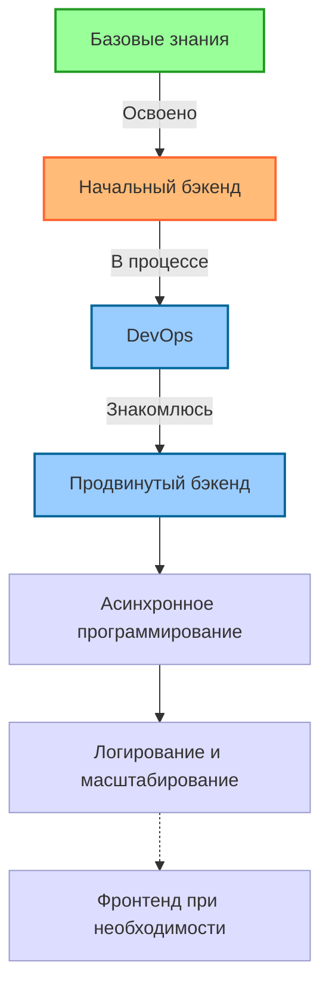

<div align="center">
  
</div>


# Привет! 👋 Я Анфиса 

### Python-разработчик, гик, автоматизатор и тот, кто любит упрощать.  

С юношества увлечена компьютерами, люблю технологии и обожаю находить решения, которые экономят время и нервы.  
Мне нравится разбираться в сложных задачах и делать их простыми.  

<p align="center">
  
  <a href="https://t.me/Anfikus"></a>
  <a href="mailto:anfisa.kov@yahoo.com"></a>
</p>

<p align="center">
  
</p>

---

## 🚀 Мой стек технологий  


### 💪 Уверенно использую
<div align="left">
  


</div>

### 🌱 Изучаю и практикую
<div align="left">


</div>

### 🔍 Знакомлюсь с
<div align="left">


</div>

---

## 🔧 Чем я занимаюсь  

<div align="center">
<table>
  <tr>
    <td width="50%">
      
      <h3 align="center">Автоматизация</h3>
      <p align="center">Парсеры, боты, обработка данных, оптимизация бизнес-процессов</p>
    </td>
    <td width="50%">
      
      <h3 align="center">Web-разработка</h3>
      <p align="center">Django, Flask, FastAPI, RESTful API</p>
    </td>
  </tr>
  <tr>
    <td width="50%">
      
      <h3 align="center">Telegram Боты</h3>
      <p align="center">Разработка ботов с интеграцией сервисов и БД</p>
    </td>
    <td width="50%">
      
      <h3 align="center">DevOps</h3>
      <p align="center">Linux, серверные скрипты, Docker, CI/CD</p>
    </td>
  </tr>
</table>
</div>

### 🌟 Примеры конкретных задач:
- ⚙️ Автоматизировала процесс сбора и обработки логистических данных, сократив время обработки на 67%
- 🔄 Разработала систему интеграции между 1С и CRM-системой через API
- 🤖 Создала Telegram-бота для автоматизации HR-процессов с уведомлениями и отчетностью

---

## 💼 Ключевые проекты

<div align="center">
  
</div>

<div align="center">
  <a href="https://github.com/anfixit">
    
  </a>
  <a href="https://github.com/anfixit">
    
  </a>
</div>
<br/>

### 🔒 VPN-сервис нового поколения


Разрабатываю VPN-решение с умной маршрутизацией, которое не блокируется провайдерами и не требует отключения для доступа к российским сервисам.


<br clear="right"/>

### 🤖 Auto-Feed Telegram Bot 


Бот для автоматического создания контента и ведения каналов с интеграцией с API новостных источников и ИИ для генерации постов.


<br clear="right"/>

### 📊 DataSync Pro


Система для синхронизации и интеграции данных между разными источниками (CRM, 1C, базы данных) с панелью управления.


---

## 🏆 Мой путь в IT  
- **С октября 2024 – по настоящее время** – Python-разработчик, фриланс  
  - Разработка ботов, парсеров, автоматизация бизнес-процессов  
  - Веб-приложения и админки на Flask и Django  
  - DevOps-настройка серверов, деплой проектов (Docker, Linux)  

- **2018 – 2024** – IT-автоматизация и управление данными в Casale SA *(международный проект, Навои / Тольятти)*  
  - Оптимизация IT-инфраструктуры, автоматизация процессов  
  - Создание и ведение баз данных для управления логистикой и ресурсами  
  - Настройка и администрирование оборудования, системная поддержка  
  - Разработка скриптов для автоматизации работы с документами и данными  
  - Поддержка пользователей, техническое сопровождение проектов  

- **2009 – 2018** – Логистика, IT-оптимизация и автоматизация бизнес-процессов  
  - Создание и ведение баз данных (MS Access, 1C)  
  - Оптимизация работы логистических процессов с помощью автоматизации  
  - Администрирование и поддержка рабочих мест сотрудников  
  - Настройка оборудования, работа с сетями и системами  
  - Улучшение документооборота, разработка макросов и скриптов  

---

## 🎓 Образование и текущее обучение

- **Курс "Диджитализируй"** от Алексея Голобурдина (в процессе)
- **Курс Python-разработчика** от Яндекса (в процессе)
- **Основы компьютерных и веб-технологий с Python** от Диджитализируй (2023)
- **Самостоятельное изучение DevOps** по roadmap.sh

---

## 🚀 Открыта для предложений

🔍 **Ищу проекты связанные с:**
- Python-разработкой (боты, парсеры, автоматизация)
- Веб-приложениями на Django/Flask/FastAPI
- DevOps задачами и системным администрированием

📍 **Формат работы:**
- Удаленная работа (предпочтительно)
- Частичная занятость/проектная работа
- Полная занятость для интересных проектов

---

## 📚 Моя дорожная карта развития

<div align="center">
  
</div>



<details>
  <summary>🔍 Подробнее о моей дорожной карте</summary>
  
```
📌 1. Базовые знания
   ✓ Python
   ✓ Git
   ✓ GitHub
   ✓ SQL

📌 2. Начальный бэкенд-разработчик
   ✓ PostgreSQL
   ✓ Flask
   ↪ Django (в процессе)

📌 3. DevOps и работа с серверами
   ↪ Bash (в процессе)
   ↪ Nginx (в процессе)
   ↪ Gunicorn
   ✓ Docker
   ↪ Docker Compose (в процессе)

📌 4. Продвинутый бэкенд-разработчик
   ↪ FastAPI (в процессе)
   ↪ SQLAlchemy
   ↪ Redis (знакомлюсь)
   ↪ OAuth2.0/OIDC

📌 5. Асинхронное программирование и оптимизация
   ↪ AsyncIO (знакомлюсь)
   ↪ RabbitMQ (знакомлюсь)
   ↪ Apache Kafka (знакомлюсь)
   ↪ ETL (Extract, Transform, Load)
   ↪ Elasticsearch (знакомлюсь)

📌 6. Логирование и масштабирование
   ↪ ELK (Elasticsearch, Logstash, Kibana)
   ↪ Clickhouse
   ↪ Dramatiq

📌 7. Фронтенд (если потребуется)
   ↪ TypeScript
   ↪ SolidJS
```

> ✓ - Уверенно использую | ↪ - Изучаю/Планирую изучать
</details>

👯 **Ищу сотрудничество по:**  
Проектам, связанным с **Python, автоматизацией процессов, парсингом и веб-разработкой**  

💬 **Спросите меня про:**  
Как автоматизировать рутину, написать бота или ускорить рутинные задачи с помощью Python  

⚡ **Факты обо мне:**  
- Люблю **пешие походы и альпинизм**  
- Читаю **городское фэнтези** и **научную фантастику**  
- Иногда нахожу что-то новое в Linux – и могу зависнуть, разбираясь с этим, на часы

---

## 📊 GitHub Статистика  

<div align="center">
  <a href="https://github.com/anfixit">
    
    
  </a>
</div>

<div align="center">
  <a href="https://github.com/anfixit">
    
  </a>
</div>

<div align="center">
  
</div>

<div align="center">
  
</div>

---

## 🏆 Планы на будущее
- 🎯 Участие в Python-хакатонах и соревнованиях
- 🌟 Развитие Open Source проектов по автоматизации
- 📚 Расширение блога на Дзен с публикацией статей по Python и автоматизации
- 🔄 Создание микросервисной архитектуры с использованием Kafka/RabbitMQ
- 🔍 Разработка поисковых решений на основе Elasticsearch
- 🚀 Применение ETL-процессов для обработки больших объемов данных

---

## 🔗 Связаться со мной

<div align="center">
  <a href="https://t.me/Anfikus">
    
  </a>
  <a href="https://github.com/anfixit">
    
  </a>
  <a href="https://dzen.ru/anfixit">
    
  </a>
  <a href="mailto:anfisa.kov@yahoo.com">
    
  </a>
</div>

---

<div align="center">
  
  
### Посмотрите мои пинned репозитории ниже! 👇

</div>

<div align="center">
  
</div>
