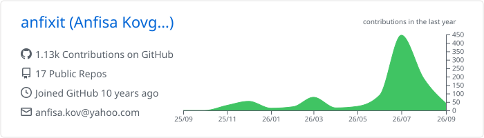
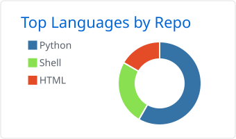
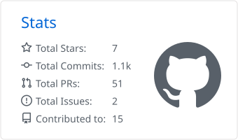

# Anfisa Kovganyuk

### Infrastructure & Security Engineer · Systems & Network Engineer · Python Automation

I build, secure and automate infrastructure that has to keep working in production.

Tolyatti, Russia · Open to remote and hybrid roles · English B2 · Russian native

---

## Profile

I work at the intersection of production infrastructure, network engineering, infrastructure security and software automation.

My background combines hands-on administration of Windows and Linux environments, Active Directory, VMware, managed networks, VPN platforms, monitoring and incident response with Python backend development, Bash automation, Docker and CI/CD.

I am especially effective where infrastructure needs to become repeatable, observable, secure and well documented.

**Target roles:** Infrastructure & Security Engineer, Systems & Network Engineer, Infrastructure Automation Engineer.

## Selected impact

| Area | Result |
| --- | --- |
| Production IT | Support infrastructure for about **50 users**, **2 Dell physical servers**, VMware, **15 managed HP switches**, corporate Wi-Fi, Windows and Linux systems |
| Distributed infrastructure | Operate a production VPN platform for about **100 users** across **13 server nodes in 9 countries** |
| Reliability | About **99.9% service availability** over the latest measured 30-day period, with individual nodes running continuously for up to 138 days |
| Automation | Reduced clean-node provisioning from about **30 minutes to 5 minutes** with an idempotent Bash deployment tool |
| Incident response | Restored Wi-Fi in **21 minutes** during a major infrastructure incident and completed full recovery in about **2 hours 20 minutes** |
| Python delivery | Added and improved about **70 automated tests** and helped reduce recurring manual operations by roughly **30-40%** |

## Competency map

### Hands-on production experience

- **Systems and identity:** Windows, Ubuntu Server, Linux administration, Active Directory, users, groups, permissions and GPO-related operations
- **Networks:** TCP/IP, subnetting, LAN, VLAN, routing, NAT, Wi-Fi, VPN, DNS, managed HP switches and packet analysis with Wireshark
- **Virtualization and operations:** VMware, server-room monitoring, UPS monitoring, incident diagnostics, recovery coordination and technical documentation
- **Security:** SSH key-only access, UFW, fail2ban, TLS certificates, Nginx and Caddy, least-privilege practices and secure secret handling
- **Containers and delivery:** Docker, Docker Compose, GitHub Actions, versioned images, health checks, smoke checks, deployment and rollback workflows
- **Observability:** SolarWinds, Prometheus, Grafana, Beszel, service logs, alerting and availability analysis
- **Development and data:** Python, Bash, FastAPI, Django, REST API, PostgreSQL, SQLAlchemy, Redis, pytest, React and TypeScript

### Architecture and troubleshooting knowledge

- Windows Event Logs and auditing, RDP diagnostics, application control, AD delegation, LAPS and privileged-account separation
- Linux logging with journald, rsyslog and auditd, package management, SSSD, Kerberos and LDAP integration concepts
- Container isolation and security: namespaces, cgroups, capabilities, seccomp, rootless containers and Docker socket risks
- High availability, load balancing, health checks, connection draining, failover testing and single points of failure
- Backup strategy, restore testing, immutable copies, retention, RTO/RPO and the difference between snapshots, replication and backups
- PostgreSQL and MySQL backup, WAL and binary logs, replication, connection pooling and cluster/failover concepts
- CI/CD security, GitHub Secrets, environment protection, deployment concurrency, readiness/liveness and rollback design

## Technology stack

### Infrastructure and security

### Automation, delivery and observability

### Backend and data

## Featured projects

| Project | What it demonstrates |
| --- | --- |
| **[routerus](https://github.com/anfixit/routerus)** | Idempotent deployment of Remnawave and Xray-core VPN nodes on Ubuntu 24.04. Includes SSH hardening, UFW, fail2ban, TLS, Nginx, secure secret handling, logging, watchdogs and TCP/XHTTP transport configuration. |
| **[anfinances](https://github.com/anfixit/anfinances)** | Self-hosted multi-currency personal finance platform with a domain-driven async FastAPI backend, typed React frontend, PostgreSQL, YNAB-style budgets, backup/restore, tests and production Docker deployment. |
| **[Python Engineering Handbook](https://github.com/anfixit/vibe-python-engineering-handbook)** | Open-source production Python standards covering architecture, security, typing, async development, FastAPI, Django, testing, Docker, CI/CD, deployment and monitoring. |
| **[router-provisioner](https://github.com/anfixit/router-provisioner)** | Cross-platform OpenWrt provisioning and automation with firmware installation, VPN configuration and reusable device profiles. |
| **[simoronator](https://github.com/anfixit/simoronator)** | Telegram bot and PWA mini-app platform built with Python, aiogram, HTML, CSS and JavaScript. |

More public work: [voice_match](https://github.com/anfixit/voice_match), [naspch_bot](https://github.com/anfixit/naspch_bot), [unpaywallbot](https://github.com/anfixit/unpaywallbot), [luci-app-podkop-sub](https://github.com/anfixit/luci-app-podkop-sub).

## Experience snapshot

### AD Plastik Togliatti · Computer Networks and Systems Technician
**September 2025 - present**

Production infrastructure for about 50 users: Windows and Linux systems, Active Directory, VMware, Dell servers, managed HP switching, corporate Wi-Fi, VPN, SolarWinds monitoring, incident response and coordination with the central IT team in Croatia.

### Independent infrastructure automation and Python development
**December 2024 - present**

Design, deployment and operation of a distributed VPN platform across 13 nodes in 9 countries. Ubuntu Server administration, Docker, Xray-core, Remnawave, Nginx, Caddy, TLS, UFW, fail2ban, Prometheus, Grafana, Bash/Python tooling, GitHub Actions and technical documentation.

### AL YWIN, Prague · Python Developer and Automation Engineer
**September 2024 - September 2025**

Python and Django backend development, PostgreSQL, REST API, data-processing automation, exception handling, validation, logging, automated tests, refactoring and Docker-based test environments in a cross-functional product team.

## Education and verified competencies

- **Degree in Applied Informatics**, Software Development Technologies, Moscow Technological Institute, 2020
- **Python Developer. Advanced**, Yandex Practicum, 612 hours, 2025
- **System Analysis**, ASTON, 2025
- **Cisco Networking Academy**, CCNA and CCNP curriculum, 2015
- **National IT Competency Assessment, 2026:**
  - API, Docker, Git, Linux and PostgreSQL: advanced theoretical level
  - Python: intermediate theoretical and practical level

## GitHub activity

<!-- Generated automatically by .github/workflows/profile-cards.yml -->

<picture>
  <source media="(prefers-color-scheme: dark)" srcset="profile-summary-card-output/github_dark/0-profile-details.svg">
  <source media="(prefers-color-scheme: light)" srcset="profile-summary-card-output/github/0-profile-details.svg">
  
</picture>

  <picture>
    <source media="(prefers-color-scheme: dark)" srcset="profile-summary-card-output/github_dark/1-repos-per-language.svg">
    <source media="(prefers-color-scheme: light)" srcset="profile-summary-card-output/github/1-repos-per-language.svg">
    
  </picture>
  <picture>
    <source media="(prefers-color-scheme: dark)" srcset="profile-summary-card-output/github_dark/3-stats.svg">
    <source media="(prefers-color-scheme: light)" srcset="profile-summary-card-output/github/3-stats.svg">
    
  </picture>

---

**Infrastructure should be understandable, reproducible and recoverable.**

[Telegram](https://t.me/Anfikus) · [Email](mailto:anfisa.kovganyuk@gmail.com) · [GitHub](https://github.com/anfixit)

